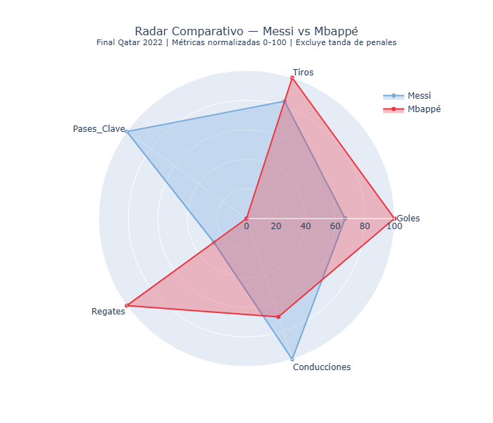
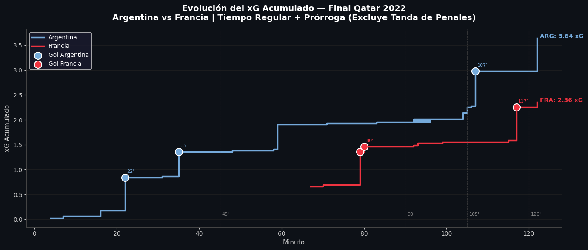
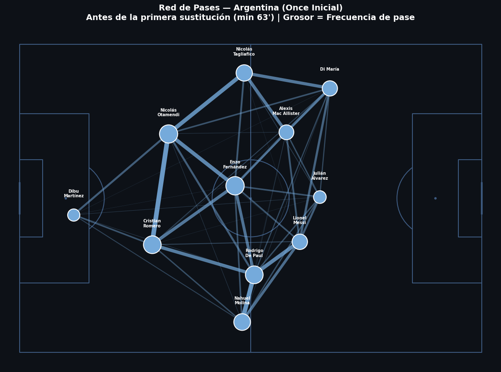
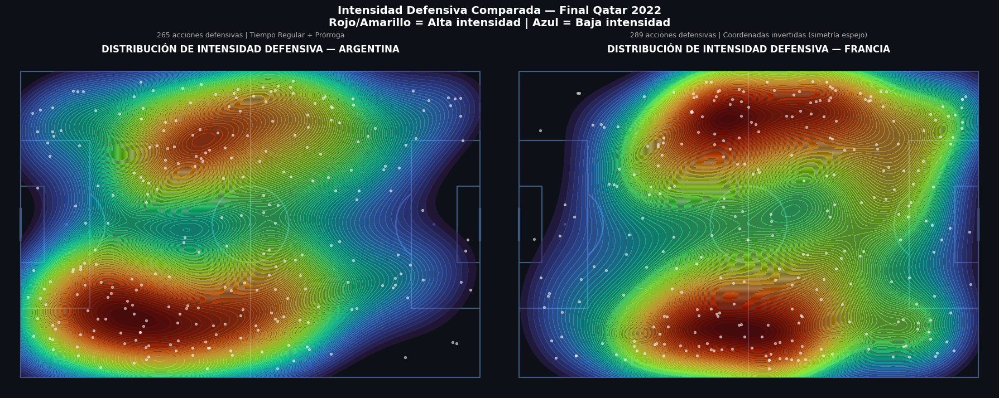
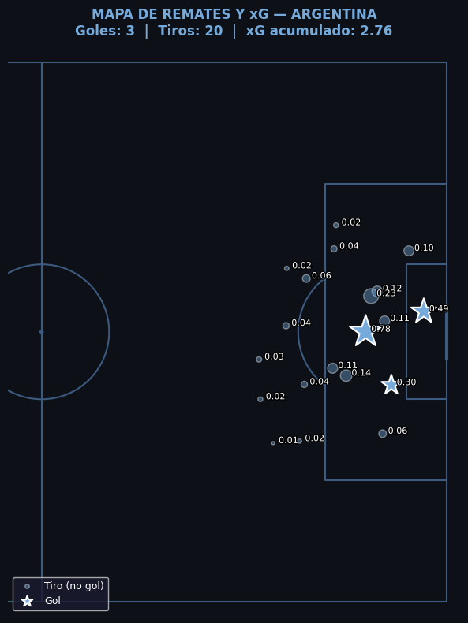
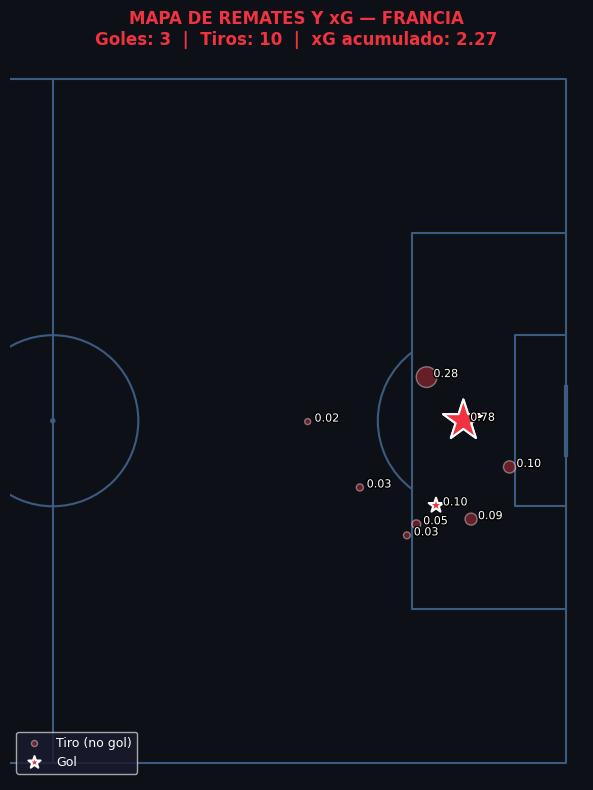

# 🏆 Qatar 2022 Sports Analytics
### Análisis de la Final del Mundial Qatar 2022 — Argentina vs Francia


---

## 📌 Descripción del Proyecto

Este proyecto aplica un pipeline completo de ciencia de datos para analizar
la Final de la Copa del Mundo Qatar 2022 entre Argentina y Francia,
considerada por muchos analistas como el partido más dramático en la
historia de los mundiales.

Utiliza los datos abiertos de **StatsBomb**, una de las empresas líderes
en analítica de fútbol, para responder cinco preguntas concretas sobre
el partido a través de modelos predictivos y visualizaciones avanzadas.

---

## ❓ Hipótesis del Proyecto

| # | Pregunta |
|---|---|
| H1 | ¿Qué equipo generó mayor peligro real medido en xG durante los 120 minutos? |
| H2 | ¿Cómo se distribuyó la presión defensiva de cada equipo en el campo? |
| H3 | ¿Cuál fue la cadena de posesión más destacada de Argentina en términos de progresión vertical? |
| H4 | ¿Qué diferencias tácticas revela la red de pases del once inicial de Argentina? |
| H5 | ¿Quién tuvo mejor rendimiento individual: Messi o Mbappé? |

---

## 🔍 Hallazgos Principales

- **Argentina** dominó los primeros 79 minutos con un xG acumulado de **2.76** vs **2.27** de Francia.
- **Francia** concentró el **37.66%** de su esfuerzo defensivo en campo rival, confirmando su presión alta asimétrica por la banda de Mbappé.
- La jugada más destacada de Argentina fue una construcción de **108 metros en 91 segundos** que terminó en el penalti del primer gol.
- La red de pases revela un sistema colectivo donde **Otamendi, Romero, Enzo Fernández y De Paul** formaron el eje de construcción.
- **Mbappé** fue más letal (3 goles, 11 regates). **Messi** fue más influyente (471m de conducción, 2 pases clave). Son perfiles opuestos, no comparables directamente.

---

## 🛠️ Tecnologías Utilizadas


---

## 📊 Visualizaciones del Proyecto

### Radar Comparativo — Messi vs Mbappé


### Evolución del xG Acumulado


### Red de Pases — Argentina (Once Inicial)


### Mapas de Calor Defensivos


### Mapa de Tiros con xG — Argentina


### Mapa de Tiros con xG — Francia


---

## 🗂️ Estructura del Proyecto

```
qatar2022-sports-analytics/
│
├── README.md
├── notebook/
│   └── SportAnalytics_FinalQatar2022.ipynb
├── assets/
│   ├── radar_messi_mbappe.png
│   ├── xg_acumulado.png
│   ├── red_pases_argentina.png
│   ├── mapas_calor_defensivos.png
│   ├── mapa_tiros_argentina.png
│   └── mapa_tiros_francia.png
└── requirements.txt
```

---

## 📦 Pipeline del Proyecto

```
Ingesta de datos      →    Exploración (EDA)     →    Ingeniería de
StatsBomb API              Auditoría de nulos          Características
JSON anidado               Distribución eventos        Distancia y ángulo
                           Análisis por período        de tiro

Modelo Predictivo     →    Visualizaciones        →    Conclusiones
XGBoost con                Radar, xG, Red de           5 Hipótesis
restricciones              pases, Mapas de             respondidas con
de monotonía               calor, Mapa tiros           datos reales
```

---

## ▶️ Cómo Ejecutar el Proyecto

### Opción A — Google Colab (recomendado)

[](https://colab.research.google.com/github/keny-lopez/qatar2022-sports-analytics/blob/main/notebook/SportAnalytics_FinalQatar2022.ipynb)

### Opción B — Ejecución local

```bash
git clone https://github.com/keny-lopez/qatar2022-sports-analytics.git
cd qatar2022-sports-analytics
pip install -r requirements.txt
jupyter notebook notebook/SportAnalytics_FinalQatar2022.ipynb
```

---

## 📋 Dependencias

```
pandas>=2.0
numpy>=1.24
matplotlib>=3.7
seaborn>=0.12
plotly>=5.0
mplsoccer>=1.2
xgboost>=1.7
scikit-learn>=1.2
jupyter>=1.0
```

---

## 📁 Fuente de Datos

Los datos provienen del repositorio abierto de **StatsBomb**, disponible
para uso académico e investigativo sin costo.

- 📦 Repositorio: [github.com/statsbomb/open-data](https://github.com/statsbomb/open-data)
- 🏆 Partido: Final FIFA World Cup Qatar 2022
- 🆔 Match ID: `3869685`
- 📊 Eventos: 4,407 acciones atómicas del partido

---

## ⚠️ Limitaciones

- El modelo xG propio fue entrenado con solo 30 tiros de un único partido.
  Los valores de StatsBomb (entrenado con millones de tiros) son más confiables.
- Las métricas de progresión de cadenas favorecen jugadas largas sobre
  transiciones rápidas. No distinguen entre construcción gradual y contragolpe.
- El análisis cubre un único partido y no generaliza el estilo de juego
  habitual de ninguno de los dos equipos.

---

## 🤝 Asistencia de IA

Este proyecto fue desarrollado con asistencia de **Claude (Anthropic)**
como herramienta de apoyo en la arquitectura del código, depuración
y documentación.

El análisis, las hipótesis, las decisiones metodológicas, la validación
de resultados y las conclusiones son responsabilidad del autor.
El uso de IA en este proyecto sigue el marco de transparencia 4D:
Delegación, Descripción, Discernimiento y Diligencia.

Todo el código fue revisado, comprendido y validado celda por celda
antes de ser incorporado al proyecto final.

---

## 👤 Autor

**Keny López**
Data Analyst & BI Specialist | Microsoft Fabric & Power BI

[](https://www.linkedin.com/in/kenylopez-data-analyst/)
[](https://github.com/keny-lopez)

---

## 📄 Licencia

Este proyecto está bajo la licencia **MIT**.
Los datos utilizados pertenecen a StatsBomb y están sujetos a su
[política de uso abierto](https://github.com/statsbomb/open-data/blob/master/LICENSE.pdf).

---

*Tegucigalda, Honduras — Junio 2026*
